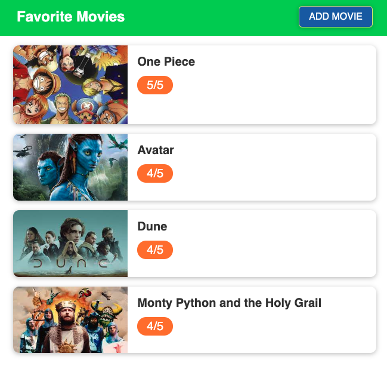
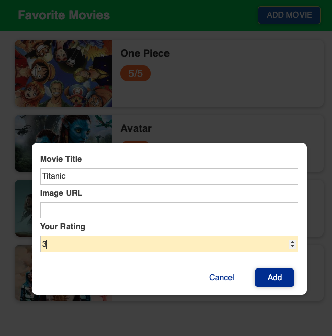
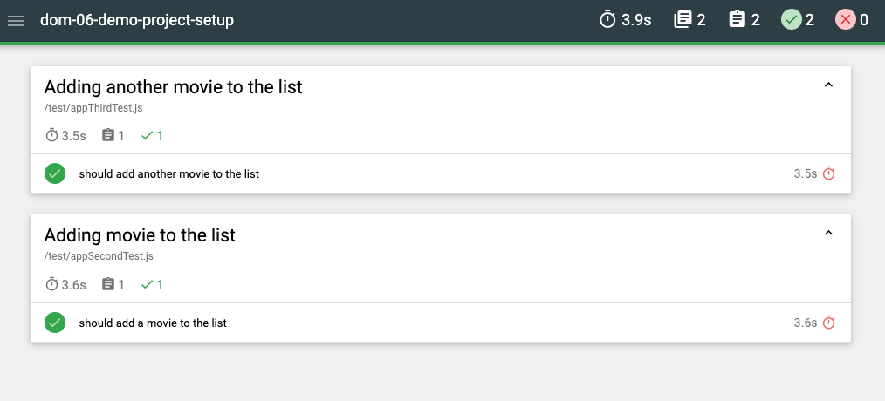
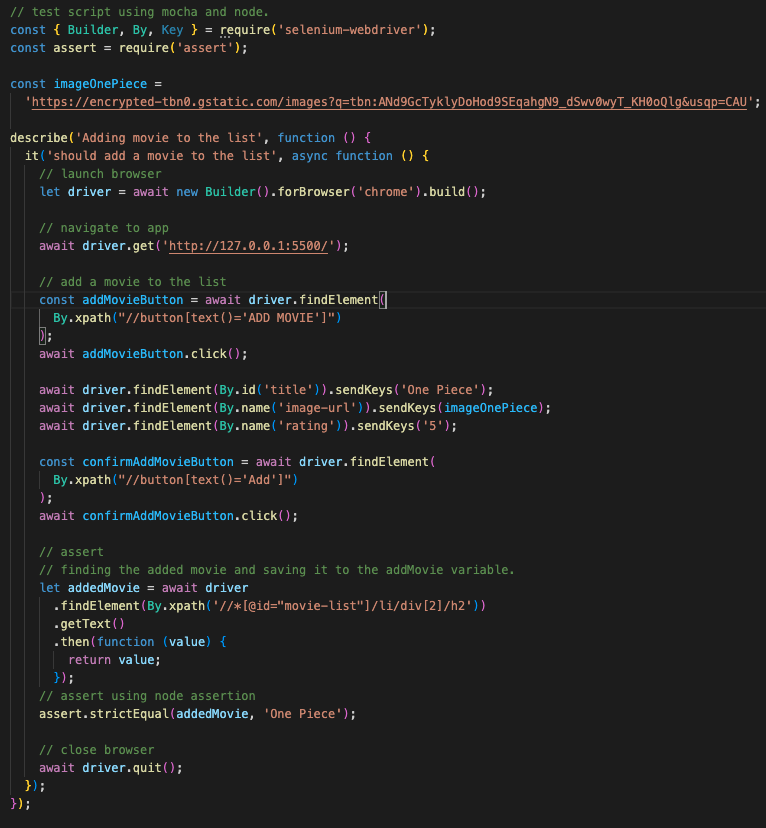

# movie-list-database

App to practice javascript and tests with Selenium + Mocha, Chai and Node. Movie list is stored in localStorage for persistence.

Form to add move to the list.

Parallel testing reporting using Mochawesome.

Test script

